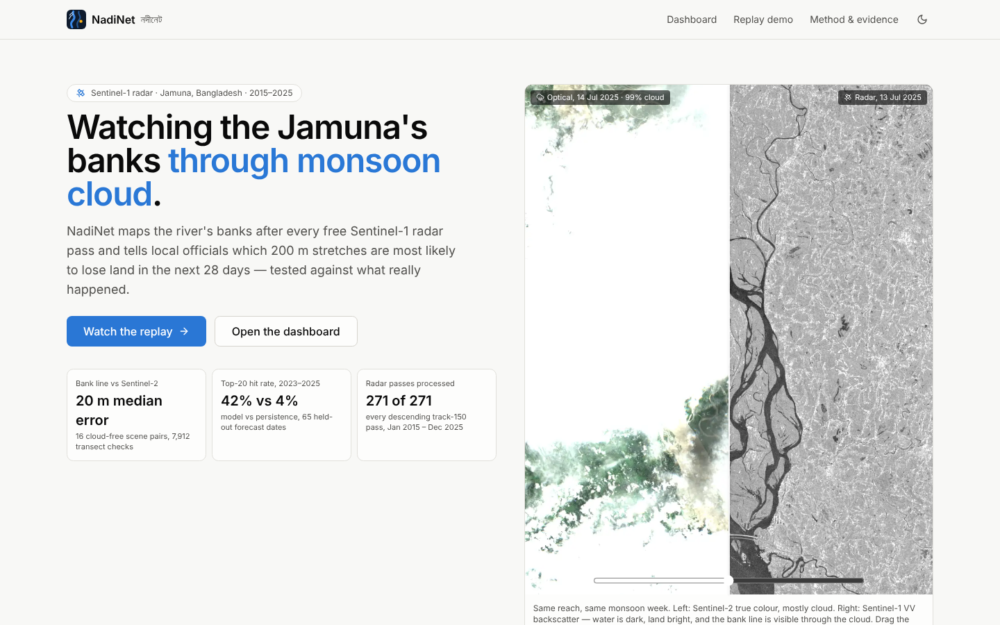
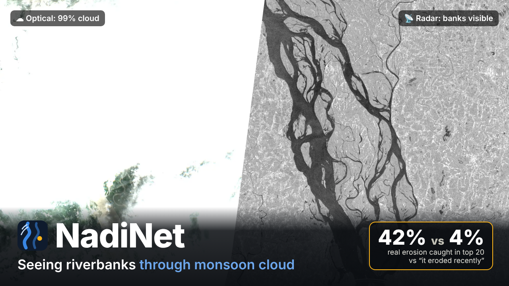
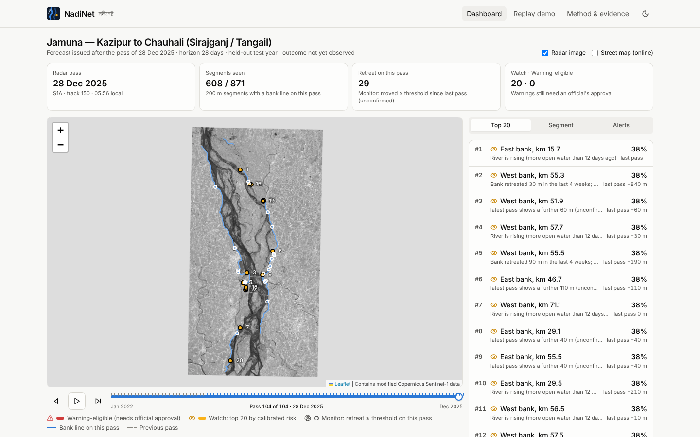
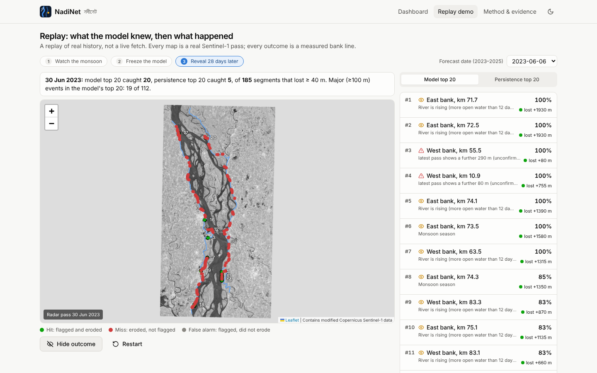
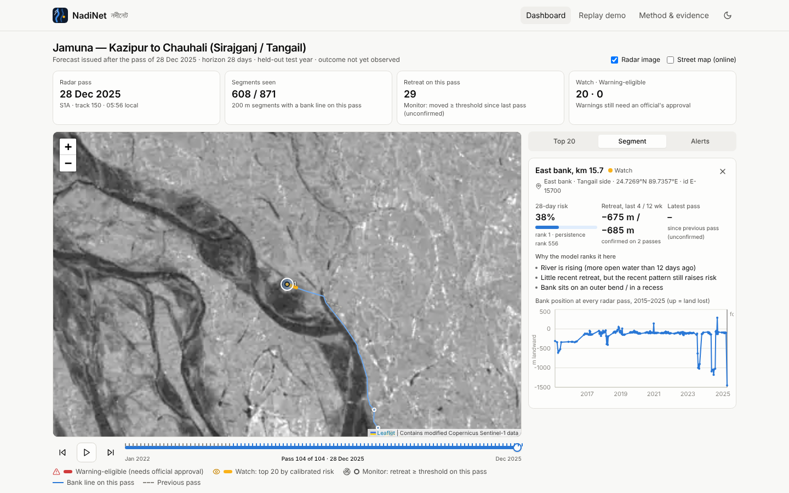
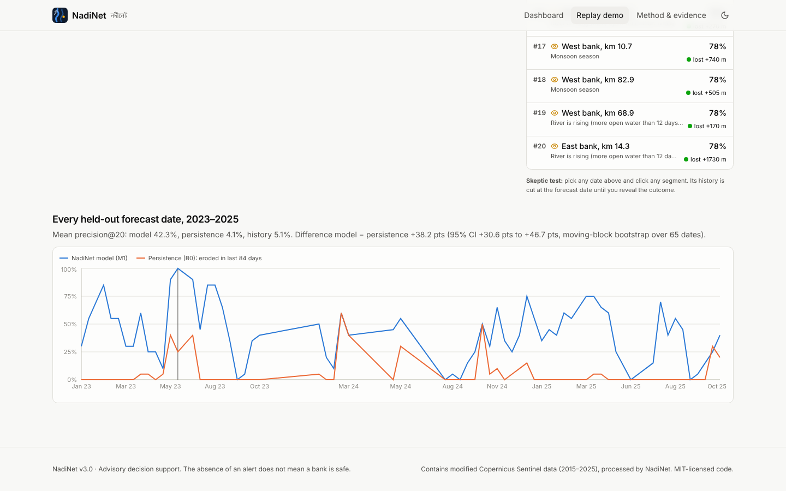
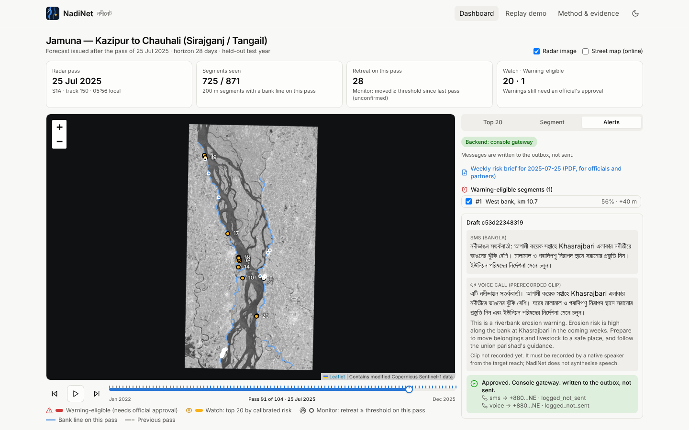
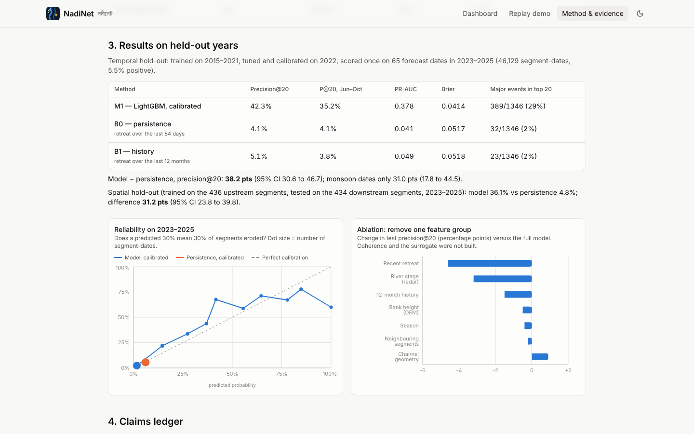
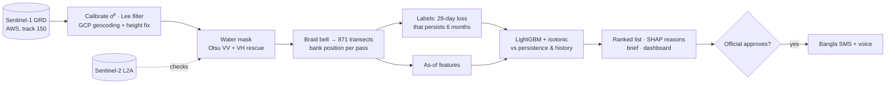

# NadiNet v3.0 — নদীনেট

**Free Sentinel-1 radar watches the Jamuna's banks through monsoon cloud, after every satellite pass, and ranks 200 m bank segments by their risk of losing land in the next 28 days — tested against what actually happened in held-out years.**



> NadiNet is advisory decision support for officials and NGOs. The absence of an alert does not mean a bank is safe. A person approves every public warning.

## Demo video

[](docs/video/nadinet_demo.mp4)

A 3-minute walkthrough of the real app: cloudy optical vs radar, the replay (freeze the model, then reveal what happened), the dashboard and the official-approved alert path. Narration script: [docs/video/NARRATION.md](docs/video/NARRATION.md).

## Results at a glance (all measured; see the [claims ledger](docs/CLAIMS_LEDGER.md))

| What | Result | How |
|---|---|---|
| Radar archive processed | **271 of 271** Sentinel-1 passes, Jan 2015 – Dec 2025 (track 150) | every pass in the public archive over the reach |
| Bank-line accuracy | **20 m median error** vs Sentinel-2 (7,912 transect checks, 16 cloud-free pairs, independent of any fitting) | `src/masks/validate_masks.py` |
| Ranking skill, held-out 2023–2025 | **Precision@20 = 42.3%** vs **4.1%** for persistence and 5.1% for 12-month history | 65 forecast dates, scored once |
| Model − persistence | **+38.2 pts** (95% CI +30.6 to +46.7); monsoon dates only +31.0 pts (+17.8 to +44.5) | moving-block bootstrap |
| Spatial hold-out (train upstream, test downstream) | **36.1% vs 4.8%**, +31.2 pts (95% CI +23.8 to +39.8) | `src/models/evaluate.py` |
| Major events (≥ 100 m) caught in the top 20 | **29%** (389 / 1,346) vs 2.4% for persistence | |
| Calibration | Brier **0.041** vs 0.052 (persistence); expected calibration error **0.013** | reliability diagram on test years |
| Update time | **~112 s** per new pass on 4 vCPUs (download → mask → banks → ranked list); data appear on AWS ~2.9 h after sensing | `scripts/time_pipeline.py` |
| Success level | **Minimum ✓ · Good ✓ · Strong ✓** (criteria fixed in advance in [docs/VALIDATION.md](docs/VALIDATION.md)) | |

**Robustness check (reporting only).** A third of test positives are very large (> 300 m) moves, often a side channel opening next to the mainland. Excluding them, the model still scores 29.6% vs 3.0% (+26.6 pts, 95% CI +19.8 to +34.6) — `data/processed/metrics/sensitivity_large_events.json`.

**Why persistence is so weak here** — a finding, not a strawman: on the Jamuna the water edge moves hundreds of metres every monsoon as low land floods and drains. "It moved recently" mostly detects inundation. The model can separate the two because it also sees river stage, how far the current edge sits from the six-month "permanent" bank (`inundation_m`), season and bank height.

## The problem

The Jamuna erodes homes, farmland and embankments every year, and much of the damage happens in the monsoon — exactly when optical satellites are blind under cloud and survey boats cannot work safely.

* Riverbank erosion displaces an estimated **50,000–200,000 people a year** in Bangladesh (RMMRU, University of Dhaka & Sussex Centre for Migration Research, 2013, as reported by [Dhaka Tribune](https://www.dhakatribune.com/science-technology-environment/climate-change/7307/the-river-that-eats-up-land-and-homes) and [Arab News](https://www.arabnews.com/node/943271)).
* **CEGIS** has issued annual erosion predictions since 2004 from pre-monsoon imagery; for 2025 it reported 348 ha lost on the Jamuna alone ([Dialogue Earth](https://dialogue.earth/en/water/new-hope-for-erosion-hit-bangladesh/)). NadiNet complements that annual forecast with a **pass-by-pass monsoon update** and a short-horizon ranking — it does not replace it.

## What NadiNet does

1. **Detection** — after each Sentinel-1 pass, the bank line of both mainland banks at 10 m, through any cloud.
2. **Risk ranking** — a calibrated probability, per 200 m segment, of losing ≥ 40 m of land within 28 days *that is still lost six months later* (the threshold is 2× the measured bank-position error).
3. **Alerts** — a weekly PDF brief and dashboard for upazila/union committees, BWDB and NGOs. A Warning (prerecorded Bangla voice call + SMS) goes to residents **only after an official approves it**.

What it does **not** claim: a 24-hour collapse forecast, sub-metre maps, bed shear stress or pore pressure, zero-shot use on other rivers, or any number not in the ledger.

## Screenshots

| Dashboard (latest pass, top 20 with reasons) | Replay: reveal 28 days later |
|---|---|
|  |  |
| **Segment history and reasons** | **Every held-out forecast date** |
|  |  |
| **Human-approved alert path** | **Method & evidence** |
|  |  |

## How it works



Details: [docs/METHODOLOGY.md](docs/METHODOLOGY.md) · [docs/ARCHITECTURE.md](docs/ARCHITECTURE.md) · [docs/VALIDATION.md](docs/VALIDATION.md).

### Three things we only found by measuring

1. **A 100 m geolocation shift.** Radar banks sat ~100 m west of optical banks on *both* sides. The product's GCP grid places the floodplain ~60 m above the ellipsoid; it actually lies below it, and the sensor looks west. A terrain-height range correction fitted on 2017–2019 pairs only took the median error on the *other* pairs to 20 m.
2. **Dry sand looks like water to C-band radar.** Against optical open water the radar mask scores IoU 0.38; against the optical active channel (water + bare sand) 0.71. The mainland bank — the edge of vegetated land — is what both sensors agree on.
3. **Inundation is not erosion.** Landward jumps of > 200 m hit 13% of consecutive passes, clustered in June–August, and reversed in September–November. Labels therefore require the loss to persist through the next low water. All three changes were made on training data, before the test years were scored, and are logged in [docs/VALIDATION.md](docs/VALIDATION.md).

## Quick start

**Offline demo (no Python, no network):**

```bash
cd app && npm install && npm run build && npm start   # http://localhost:3000
```

All maps, rankings, charts and PDF briefs are precomputed in `app/public/data`. Alert actions run in a clearly labelled offline mode.

**Full stack (dashboard + API + console alert gateway):**

```bash
pip install -r requirements.txt
bash scripts/start_demo.sh           # API on :8000, dashboard on :3000
```

**Docker (full stack, one command):**

```bash
docker compose up --build            # dashboard http://localhost:3000, API http://localhost:8000/docs
```

**Deploy:** dashboard on Vercel (project root `app/`, config in `app/vercel.json`; works with no backend), API on Render/Railway from the root `Dockerfile` (`render.yaml` included). Set `NADINET_API_URL` on Vercel to the API's URL to enable the live alert path.

**Reproduce everything from the raw archive** (~1 h on 4 vCPUs, ~11 GB cache):

```bash
pip install -r requirements.txt
bash scripts/run_pipeline.sh         # catalogue → masks → banks → S2 check → labels → features → model
bash scripts/evaluate_model.sh       # scores 2023–2025 once (re-runs need RERUN_REASON=...)
python -m pytest                     # 37 tests, incl. tests/test_no_leakage.py on the real archive
python notebooks/make_notebooks.py --execute
```

Sentinel-1 is read from the public `sentinel-s1-l1c` bucket over HTTPS; AWS lists it as Requester Pays, so outside our build environment you may need AWS credentials (see `.env.example`). The Earth Engine scripts in `gee/` implement the same method for teams with an EE account; they produced none of the results above.

## Repository

```
src/        pipeline: masks/ banks/ labels/ features/ models/ explain/ alerts/ api/  (+ config, geo, claims)
app/        Next.js 14 dashboard (landing, dashboard, replay demo, method & evidence)
data/       catalogue, bank positions, labels, features, model, metrics, demo predictions (raw cache gitignored)
docs/       ARCHITECTURE · METHODOLOGY · VALIDATION · CLAIMS_LEDGER · LIMITATIONS · PARTNERS · DEMO_SCRIPT
notebooks/  01–07, executed: data → masks → banks → features → training → validation → ablation
tests/      masks, banks, labels, features, models, API, no-leakage
scripts/    download_data · run_pipeline · train_model · evaluate_model · start_demo · time_pipeline · screenshots
gee/        Earth Engine alternative ingestion (not used for results)
```

## Technologies

Python 3.13 · rasterio/GDAL (HTTP range reads of COGs) · NumPy/SciPy/scikit-image · GeoPandas/Shapely/pyproj · LightGBM · scikit-learn (isotonic calibration) · TreeSHAP · FastAPI/Pydantic v2 · ReportLab · Next.js 14 (App Router) · React 18 · TypeScript · Tailwind CSS + shadcn/ui-style Radix primitives · Leaflet · Recharts · Framer Motion · Playwright (screenshots) · pytest · ruff.

## Target users

* **Upazila and union disaster management committees** (Kazipur, Sirajganj Sadar, Chauhali, Shahjadpur; Bhuapur, Tangail Sadar, Nagarpur) and **BWDB field offices** — weekly ranked list to target inspections and emergency works.
* **NGOs in char and riverbank areas** — relocation support and anticipatory cash.
* **Riverbank households** — reached only through those institutions, by an official-approved Bangla voice call and SMS.

Partners, funding and the honest moat: [docs/PARTNERS.md](docs/PARTNERS.md).

## Limitations (short version)

One track and one ~83 km reach; 12-day revisit with gaps (incl. June–August 2024). No gauge or forecast forcing (FFWC/GloFAS were unreachable from the build environment; stage is a radar proxy). Sentinel-2 validation covers the northern two-thirds of the reach in the dry season. Labels come from the same radar masks as the features. Very large "losses" are often side channels opening beside the mainland. Coherence and the neural-operator surrogate were not built. The Bangla voice clip is not recorded yet — it must be recorded by a native speaker from the reach. Full list: [docs/LIMITATIONS.md](docs/LIMITATIONS.md).

## Data and licences

Contains modified Copernicus Sentinel-1 and Sentinel-2 data (2015–2025); Copernicus DEM GLO-30 © DLR e.V. 2010–2014 and © Airbus Defence and Space GmbH 2014–2018, provided under COPERNICUS by the EU and ESA. Code: [MIT](LICENSE). Details: [data/README.md](data/README.md).

## Sources (context only, not NadiNet measurements)

* Displacement estimate: RMMRU/Sussex 2013 study via [Dhaka Tribune](https://www.dhakatribune.com/science-technology-environment/climate-change/7307/the-river-that-eats-up-land-and-homes), [Arab News](https://www.arabnews.com/node/943271).
* CEGIS annual predictions since 2004 and 2025 figures: [Dialogue Earth](https://dialogue.earth/en/water/new-hope-for-erosion-hit-bangladesh/).
* Sentinel-1C launched 5 Dec 2024, Sentinel-1D on 4 Nov 2025: [ESA Sentinel-1](https://www.esa.int/Applications/Observing_the_Earth/Copernicus/Sentinel-1). No Sentinel-1C product for track 150 was found in the AWS archive for 2025.
* USGS Digital Shoreline Analysis System (transect method); Pekel et al. (2016), *Nature* 540, JRC Global Surface Water.
