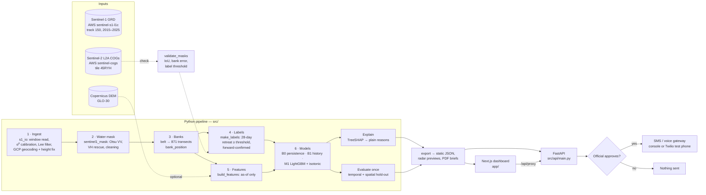

# Architecture

NadiNet is a batch pipeline that turns each Sentinel-1 pass into a ranked list
of bank segments, plus a dashboard and an alert path where a person decides.
Everything is software; every input is open data.

Optical data only checks the radar masks and supplies the "cloudy monsoon"
comparison image; nothing in the pipeline depends on a clear sky.

## Components

| Path | Role | Key choices |
|---|---|---|
| `src/masks/s1_io.py` | Catalogue + ingest | HTTP range reads of tiled GRD GeoTIFFs; σ⁰ from the product's own LUT; Lee 5×5; inverse of the 21×10 GCP grid by spline + Newton; constant-height range correction |
| `src/masks/sentinel1_mask.py` | Water mask per pass | Otsu on VV dB with plausibility bounds; VH rescue within +3 dB; 3×3 opening; 0.5 ha blob rules |
| `src/masks/validate_masks.py` | Detection check | Sentinel-2 MNDWI (open water) and MNDWI ∨ NDVI<0.15 (active channel); IoU and per-transect bank error |
| `src/banks/belt.py` | Braid belt | river-connected water + enclosed chars; bridge deck burnt in; khals cut by a 150 m opening |
| `src/banks/baselines.py`, `transects.py` | DSAS-style geometry | baseline fixed once from 2015; 200 m transects, 1.5 km riverward / 4 km landward |
| `src/banks/bank_position.py` | Per-pass measurements | bank = first 30 m belt run from the landward end; channel distance, width, char shielding, in-belt water |
| `src/labels/make_labels.py` | Targets | nearest pass to t+28 d (±8 d); forward confirmation over 36 d; threshold from validation |
| `src/features/*` | As-of features | backward-confirmed positions; stage proxy; neighbours; curvature; DEM bank height |
| `src/models/*` | Baselines, LightGBM, calibration, evaluation, ablation | fixed tuning grid on 2022; isotonic on 2022; moving-block bootstrap; test-once lock |
| `src/explain/shap_reasons.py` | Reasons | LightGBM TreeSHAP grouped into plain-language reasons |
| `src/alerts/*` | Brief PDF, dispatch | tiers from the calibration year; dispatch refuses without an `Approval` |
| `src/api/export.py` | Precompute | static JSON + WebP radar previews (Web Mercator) + PDF briefs |
| `src/api/main.py` | FastAPI | read endpoints + draft/approve/reject alerts + brief PDF |
| `app/` | Next.js 14 dashboard | static-first: works with no backend; Leaflet with radar as the base map |
| `gee/` | Alternative ingestion | Earth Engine version of steps 1–2; not used for committed results |

## Data flow and storage

| Stage | Location | Size | In git? |
|---|---|---|---|
| Pass catalogue | `data/processed/s1_catalog.json` | 0.4 MB | yes |
| Cached σ⁰ (uint8 dB, 2 bands) | `data/raw/sentinel1/` | ~40 MB / pass | no |
| Water masks | `data/processed/water_masks/` | ~0.4 MB / pass | summary only |
| Baselines, transects | `data/processed/bank_lines/`, `transects/` | < 1 MB | yes |
| Bank positions (all passes × transects) | `data/processed/transects/bank_positions.parquet` | few MB | yes |
| Features, labels | `data/processed/features/`, `data/labels/` | few MB | yes |
| Model, calibrators, metrics | `data/processed/models/`, `metrics/` | < 1 MB | yes |
| Demo predictions | `data/demo/predictions_<year>.parquet` | < 2 MB | yes |
| Dashboard data | `app/public/data/` | ~20 MB | yes |

## Runtime modes

* **Offline demo** (default): `app/` reads `public/data/*.json`; alert actions
  run in a clearly labelled offline mode (logged in the browser, nothing sent).
* **With backend**: set `NADINET_API_URL`; the Next.js route
  `/api/proxy/[...path]` forwards to FastAPI. Gateway `console` writes an
  outbox; `twilio` sends to the registered test phone.
* **Operational update** (one new pass): `scripts/time_pipeline.py` times
  exactly this path; see the claims ledger for the measured duration.

## Deployment

* Frontend: Vercel (root `app/`, no env needed for offline mode).
* Backend: any container host (Railway/Render): `uvicorn src.api.main:app`,
  with `app/public/data` available (set `NADINET_STATIC_DATA`).
* Pipeline: a single 4-vCPU machine reprocessed the full 2015–2025 archive
  for one reach in about an hour; a new pass takes minutes (measured in
  `data/processed/metrics/timing.json`).
